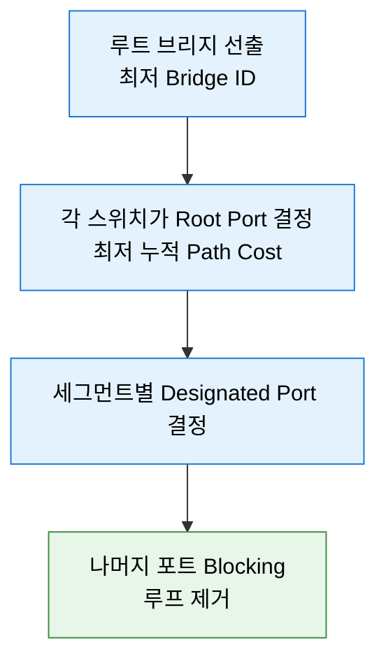

# STP (Spanning Tree Protocol)

## 정의

**IEEE 802.1D** 표준으로, 이중화된 L2 경로에서 **BPDU**를 교환해 논리적 트리를
구성하고 잉여 경로를 차단함으로써 브로드캐스트 스톰과 MAC 테이블 불안정을 방지하는
루프 방지 프로토콜.

## 특징

- **(BPDU 기반)** 스위치 간 2초 주기로 Bridge Protocol Data Unit을 교환해 토폴로지를 공유한다
- **(루트 브리지 선출)** Bridge ID(우선순위 + MAC)가 가장 낮은 스위치가 루트가 된다
- **(포트 차단)** 루프를 만드는 포트를 Blocking 상태로 두어 물리 이중화는 유지하고 논리 루프만 제거한다
- **(자동 재수렴)** 링크 장애 시 차단 포트를 다시 살려 경로를 복구한다
- **(VLAN 단위 동작)** Cisco PVST+는 VLAN마다 별도 트리를 계산해 VLAN별 부하 분산이 가능하다

## 왜 필요한가?

L2 스위치는 라우터와 달리 프레임에 **TTL이 없다**. 이중화를 위해 스위치를 링 구조로
연결하면, 브로드캐스트 프레임 하나가 링을 무한히 순환하며 다음 세 가지가 동시에 발생한다.

1. **브로드캐스트 스톰** — 프레임이 기하급수적으로 증폭되어 대역폭을 소진한다
2. **MAC 테이블 불안정(flapping)** — 같은 출발지 MAC이 여러 포트에서 학습되어 테이블이 계속 뒤집힌다
3. **중복 프레임 수신** — 목적지가 같은 프레임을 여러 번 받아 상위 프로토콜이 오작동한다

STP는 물리 이중화를 유지한 채 논리 경로를 트리로 만들어 이 셋을 한 번에 없앤다.

## 구성 요소

| 구성 요소 | 역할 | 결정 기준 |
| --- | --- | --- |
| Root Bridge | 트리의 기준점 | Bridge ID(우선순위 + MAC 주소)가 가장 낮은 스위치 |
| Root Port | 루트로 향하는 최적 포트 | 루트까지의 누적 Path Cost가 가장 낮은 포트 |
| Designated Port | 세그먼트를 대표해 전달하는 포트 | 세그먼트에서 루트까지 비용이 가장 낮은 쪽 |
| Blocked Port | 루프를 만드는 포트 | 위 둘 중 어느 것도 아닌 포트 |

**Path Cost (Cisco 기본 short 모드)**

| 링크 속도 | Cost |
| --- | --- |
| 10 Mbps | 100 |
| 100 Mbps | 19 |
| 1 Gbps | 4 |
| 10 Gbps | 2 |

## 동작 흐름



**포트 상태 전이 (802.1D)**

Blocking → Listening(15초) → Learning(15초) → Forwarding. Blocking에서 시작하면
Max Age 20초가 더해져 **최대 50초**가 소요된다. 이 지연이 RSTP가 등장한 이유다.

## STP 표준 비교

| 구분 | STP (802.1D) | RSTP (802.1w) | MSTP (802.1s) |
| --- | --- | --- | --- |
| 수렴 시간 | 최대 50초 | 1초 이내 | 1초 이내 |
| 포트 역할 | Root / Designated / Blocked | + Alternate / Backup | RSTP와 동일 |
| 트리 개수 | 전체 1개 (CST) | 전체 1개 | VLAN 그룹(인스턴스) 단위 |
| 수렴 방식 | 타이머 만료 대기 | Proposal/Agreement 핸드셰이크 | RSTP 기반 |
| Cisco 구현 | PVST+ | Rapid PVST+ | MST |

VLAN이 수백 개인 환경에서 Rapid PVST+는 VLAN마다 트리를 계산해 CPU 부담이 크다.
이때 VLAN을 소수 인스턴스로 묶는 **MST**를 선택한다.

## 설정 및 검증

```
! Rapid PVST+ 활성화 (Cisco 기본값은 PVST+)
Switch(config)# spanning-tree mode rapid-pvst

! 루트 브리지 지정 — 우선순위를 낮춰 결정론적으로 만든다
Switch(config)# spanning-tree vlan 10 root primary
Switch(config)# spanning-tree vlan 10 root secondary

! 단말 접속 포트: 즉시 Forwarding + BPDU 수신 시 차단
Switch(config)# interface range gi1/0/1 - 24
Switch(config-if-range)# spanning-tree portfast
Switch(config-if-range)# spanning-tree bpduguard enable
```

**검증**

```
Switch# show spanning-tree vlan 10        ! 루트 여부, 포트 역할·상태
Switch# show spanning-tree root           ! VLAN별 루트 브리지와 비용
Switch# show spanning-tree interface gi1/0/1 detail
```

`show spanning-tree vlan 10`에서 `This bridge is the root`가 보이면 루트 지정이
적용된 것이다. 의도한 스위치가 루트가 아니면 우선순위 설정부터 확인한다.

## 활용 시나리오

- **액세스 계층 단말 포트** — PortFast + BPDU Guard를 함께 건다. PortFast만 걸면
  사용자가 꽂은 스위치의 BPDU가 토폴로지를 뒤집을 수 있다.
- **디스트리뷰션 이중화** — 루트를 명시 지정하고 Secondary까지 지정해, 장애 시
  루트가 예측 가능한 스위치로 넘어가게 한다.
- **VLAN 부하 분산** — 홀수 VLAN은 SW1, 짝수 VLAN은 SW2를 루트로 지정해 업링크를 나눠 쓴다.

## CCNP/CCIE 시험 포인트

- **루트 선출 기준 순서**: Bridge Priority → MAC 주소. 우선순위는 4096의 배수로만 설정된다
- **`root primary`의 실제 동작**: 우선순위를 24576으로 낮추거나, 현재 루트보다 4096 낮게 설정한다
- **PortFast는 루프를 막지 않는다** — 단말 포트 지연만 없앤다. 보호는 BPDU Guard가 한다
- **Root Guard vs BPDU Guard**: Root Guard는 우월한 BPDU 수신 시 포트를 root-inconsistent로,
  BPDU Guard는 BPDU 수신 자체로 err-disable로 만든다
- **RSTP가 빠른 이유**는 타이머 단축이 아니라 Proposal/Agreement 핸드셰이크다
