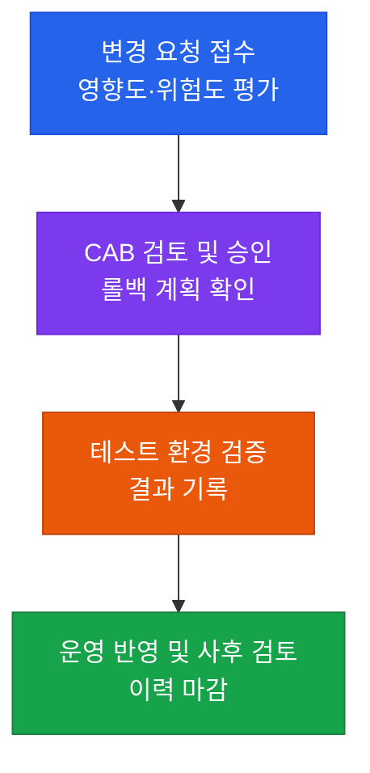

# 변경관리 통제
**Change Management Control**

:::info 관련 표준
CISA Domain 4.3 / ISO/IEC 20000-1 / COBIT 2019 BAI06 / NIST SP 800-128
:::

<table>
  <colgroup>
    <col style={{width: '20%'}} />
    <col style={{width: '80%'}} />
  </colgroup>
  <tbody>
    <tr><td><strong>문서번호</strong></td><td>BP-OPS-03</td></tr>
    <tr><td><strong>제개정일</strong></td><td>2026-03-14</td></tr>
    <tr><td><strong>관리부서</strong></td><td>IT 감사실</td></tr>
    <tr><td><strong>적용범위</strong></td><td>운영 환경에 배포되는 모든 애플리케이션·인프라·설정 변경</td></tr>
    <tr><td><strong>통제목적</strong></td><td>승인되지 않았거나 검증되지 않은 변경이 운영 환경에 반영되지 않도록 한다</td></tr>
  </tbody>
</table>

---

## 1. 개요 및 배경

운영 장애의 상당수는 외부 공격이 아니라 **조직 스스로 가한 변경**에서 비롯된다.
배포·설정 수정·권한 조정처럼 일상적인 작업이 검증 없이 반영되면, 원인 추적이
어려운 형태로 서비스가 중단된다. 변경관리 통제는 이 위험을 "변경을 줄여서"가 아니라
**"모든 변경이 승인·검증·기록을 거치게 해서"** 낮춘다.

규제 측면에서도 변경 이력은 핵심 증적이다. 재무제표에 영향을 주는 시스템의 변경이
승인 없이 이뤄졌다면, 그 시스템이 산출한 수치의 신뢰성 자체가 흔들린다.

CISA 감사인 관점의 핵심 검증 포인트는 세 가지다. **(1)** 운영 반영된 변경 전부가
승인 기록과 1:1로 대응하는가, **(2)** 요청자와 승인자, 배포자가 분리되어 있는가,
**(3)** 긴급 변경이 사후 승인 절차로 반드시 회수되는가.

---

## 2. 핵심 개념 및 원칙

### 2.1 변경 유형 구분

| 구분 | 정의 | 승인 경로 | 감사 시 확인 사항 |
|------|------|----------|-----------------|
| 표준 변경 | 사전 승인된 반복 작업 | 사전 정의된 절차로 갈음 | 표준 변경 목록이 주기적으로 재승인되는가 |
| 일반 변경 | 계획된 신규·수정 작업 | 변경자문위원회(CAB) 승인 | 승인 일자가 배포 일자보다 앞서는가 |
| 긴급 변경 | 장애 복구를 위한 즉시 변경 | 사후 승인 (기한 명시) | 사후 승인이 기한 내 완결되었는가 |

긴급 변경은 통제의 예외가 아니라 **승인 시점만 뒤로 미룬 통제**다. 사후 승인이
쌓인 채 방치되면 긴급 변경 경로가 일반 변경의 우회로로 쓰인다.

### 2.2 직무 분리 원칙

요청·승인·구현·운영 반영이 한 사람에게 모이지 않아야 한다. 인력이 적은 조직에서
완전 분리가 어렵다면, **보완 통제**(배포 로그 사후 검토, 4-eyes 승인)를 문서로
정의하고 그 수행 증적을 남긴다. 감사인은 분리 불가 자체보다 **보완 통제의 부재**를
결함으로 본다.

---

## 3. 프로세스 / 방법론

### 3.1 표준 변경관리 절차

각 단계는 **다음 단계로 넘어간 증적**을 남긴다. 승인 없이 테스트로 넘어간 건이
있다면 그 자체가 통제 우회 사례다.

### 3.2 증적 대응표

| 절차 단계 | 생성 증적 | 보관 위치 예시 |
|-----------|----------|---------------|
| 요청 | 변경요청서(RFC), 영향도 평가서 | ITSM 티켓 |
| 승인 | CAB 회의록, 승인자 서명 이력 | ITSM 승인 로그 |
| 검증 | 테스트 결과서, 롤백 시나리오 | 테스트 관리 도구 |
| 반영 | 배포 로그, 형상 버전, 변경 전후 비교 | CI/CD 파이프라인 로그 |

---

## 4. CISA 감사 체크리스트

:::tip 활용 안내
본 체크리스트는 내부 감사원 및 외부 컴플라이언스 대응 시 증적 자산으로 활용한다.
:::

<table>
  <colgroup>
    <col style={{width: '7%'}} />
    <col style={{width: '23%'}} />
    <col style={{width: '38%'}} />
    <col style={{width: '32%'}} />
  </colgroup>
  <thead>
    <tr>
      <th>ID</th>
      <th>통제 목적</th>
      <th>감사 수행 절차</th>
      <th>필수 증적 파일</th>
    </tr>
  </thead>
  <tbody>
    <tr>
      <td><strong>AUD-OPS-01</strong></td>
      <td>모든 운영 변경이 승인을 거쳤는지 확인</td>
      <td>감사 기간 배포 로그 전건을 모집단으로 추출해, ITSM 승인 기록과 대사(對査). 누락 건 전수 소명</td>
      <td>배포 로그 원본, ITSM 변경 티켓 목록</td>
    </tr>
    <tr>
      <td><strong>AUD-OPS-02</strong></td>
      <td>승인이 배포에 선행했는지 확인</td>
      <td>표본 25건의 승인 타임스탬프와 배포 타임스탬프를 비교. 역전 건은 긴급 변경 여부 확인</td>
      <td>승인 이력(타임스탬프 포함), 배포 이력</td>
    </tr>
    <tr>
      <td><strong>AUD-OPS-03</strong></td>
      <td>직무 분리 준수 여부 확인</td>
      <td>표본 건의 요청자·승인자·배포자 계정을 대조해 동일인 여부 검사. 동일 시 보완 통제 수행 증적 확인</td>
      <td>계정 권한 매트릭스, 보완 통제 수행 기록</td>
    </tr>
    <tr>
      <td><strong>AUD-OPS-04</strong></td>
      <td>긴급 변경의 사후 승인 완결성 확인</td>
      <td>긴급 변경 전건을 추출해 사후 승인 완료 여부와 소요일을 집계. 기한 초과 건 목록화</td>
      <td>긴급 변경 목록, 사후 승인 기록</td>
    </tr>
    <tr>
      <td><strong>AUD-OPS-05</strong></td>
      <td>롤백 가능성 확보 여부 확인</td>
      <td>표본 건의 롤백 계획 존재와 실행 가능성 검토. 실제 롤백 사례가 있으면 결과 기록 확인</td>
      <td>롤백 시나리오, 롤백 수행 로그</td>
    </tr>
  </tbody>
</table>

---

## 5. 관련 표준 및 참고

| 표준 | 관련 조항 | 요구사항 요지 |
|------|----------|--------------|
| ISO/IEC 20000-1 | 8.5.1 변경관리 | 변경의 기록·승인·검증 절차 수립 |
| COBIT 2019 | BAI06 | 변경 수용 및 통제 관행 |
| NIST SP 800-128 | 3.2 | 보안 관점의 형상 변경 통제 |
