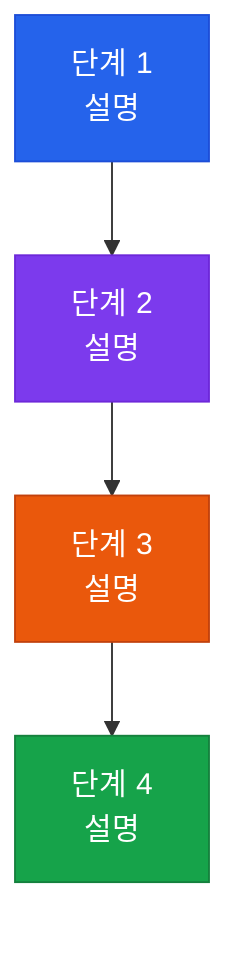

# CISA 지식베이스 문서 표준 템플릿

이 파일을 복사해 새 문서 작성 시 사용한다.
`[대괄호]` 항목은 반드시 채워야 한다.

---

## 완전한 문서 템플릿

```markdown
---
sidebar_position: [N]
title: [X.X 한글 제목]
---

# [한글 제목]
**[English Title]**

:::info 관련 표준
CISA Domain [X.X] / [ISO/IEC XXXXX] / [NIST SP 800-XXX]
:::

<table>
  <colgroup>
    <col style={{width: '20%'}} />
    <col style={{width: '80%'}} />
  </colgroup>
  <tbody>
    <tr><td><strong>문서번호</strong></td><td>[BP-XXX-NN]</td></tr>
    <tr><td><strong>제개정일</strong></td><td>[YYYY-MM-DD]</td></tr>
    <tr><td><strong>관리부서</strong></td><td>[IT 감사실 / ...]</td></tr>
    <tr><td><strong>적용범위</strong></td><td>[적용 대상 시스템·조직·프로세스]</td></tr>
    <tr><td><strong>통제목적</strong></td><td>[이 문서가 달성하려는 통제 목적 1문장]</td></tr>
  </tbody>
</table>

---

## 1. 개요 및 배경

[2~3문단. 이 통제가 왜 필요한지 비즈니스·규제 맥락으로 설명.
마지막 문단에 CISA 감사인 관점의 핵심 검증 포인트 언급.]

---

## 2. 핵심 개념 및 원칙

### 2.1 [소제목]

[표 또는 목록으로 핵심 개념 정의. 비교표 권장.]

| 구분 | 설명 | 비고 |
|------|------|------|
| ... | ... | ... |

### 2.2 [소제목]

[추가 개념이나 원칙]

---

## 3. 프로세스 / 방법론

### 3.1 [프로세스명]

[단계별 실무 지침]



### 3.2 [추가 다이어그램 또는 표]

[필요 시 두 번째 Mermaid 다이어그램 또는 상세 표]

---

## 4. CISA 감사 체크리스트

:::tip 활용 안내
본 체크리스트는 내부 감사원 및 외부 컴플라이언스 대응 시 증적 자산으로 활용한다.
:::

<table>
  <colgroup>
    <col style={{width: '7%'}} />
    <col style={{width: '23%'}} />
    <col style={{width: '38%'}} />
    <col style={{width: '32%'}} />
  </colgroup>
  <thead>
    <tr>
      <th>ID</th>
      <th>통제 목적</th>
      <th>감사 수행 절차</th>
      <th>필수 증적 파일</th>
    </tr>
  </thead>
  <tbody>
    <tr>
      <td><strong>AUD-XX-01</strong></td>
      <td>[통제 목적 — ~인지 확인]</td>
      <td>1. [첫 번째 감사 절차]<br/>2. [두 번째 감사 절차]<br/>3. [세 번째 감사 절차]<br/>4. [네 번째 감사 절차]</td>
      <td>[증적 파일 1]<br/>[증적 파일 2]<br/>[증적 파일 3]</td>
    </tr>
    <tr>
      <td><strong>AUD-XX-02</strong></td>
      <td>[통제 목적]</td>
      <td>1. [절차]<br/>2. [절차]<br/>3. [절차]</td>
      <td>[증적 1]<br/>[증적 2]</td>
    </tr>
    <tr>
      <td><strong>AUD-XX-03</strong></td>
      <td>[통제 목적]</td>
      <td>1. [절차]<br/>2. [절차]<br/>3. [절차]</td>
      <td>[증적 1]<br/>[증적 2]</td>
    </tr>
    <tr>
      <td><strong>AUD-XX-04</strong></td>
      <td>[통제 목적]</td>
      <td>1. [절차]<br/>2. [절차]<br/>3. [절차]</td>
      <td>[증적 1]<br/>[증적 2]</td>
    </tr>
  </tbody>
</table>

---

## 5. 관련 표준 및 참고

| 표준/프레임워크 | 발행 기관 | 관련 조항 | 내용 요약 |
|----------------|----------|-----------|-----------|
| [표준명] | [기관] | [조항] | [요약] |
| [표준명] | [기관] | [조항] | [요약] |

---

## 관련 문서

- [X.X 연관 문서 제목](/docs/[domain]/[filename]) — [연관 이유 한 줄]
- [X.X 연관 문서 제목](/docs/[domain]/[filename]) — [연관 이유 한 줄]
- [X.X 연관 문서 제목](/docs/[domain]/[filename]) — [연관 이유 한 줄]
```

---

## 작성 예시: 감사 체크리스트 ID 명명 규칙

| 도메인 | ID 접두어 예시 |
|--------|--------------|
| Domain 1 (감사 방법론) | `AUD-01-01`, `AUD-02-01` |
| Domain 2 (IT 거버넌스) | `AUD-GOV-01`, `AUD-FRM-01` |
| Domain 3 (시스템 개발) | `AUD-DEV-01`, `AUD-PIR-01` |
| Domain 4 (IT 운영) | `AUD-01` ~ `AUD-04` 또는 `AUD-CR-01` |
| Domain 5 (정보 보안) | `AUD-IR-01`, `AUD-SEC-01` |
| Domain 6 (툴킷) | `AUD-TKT-01` |

---

## 자주 쓰는 :::admonition 유형

```markdown
:::info 관련 표준
CISA Domain X.X / ISO 27001:2022 / NIST CSF 2.0
:::

:::tip 활용 안내
실무 활용 팁이나 중요 사용 안내
:::

:::warning 핵심 통제
반드시 지켜야 할 중요 통제 사항
:::

:::note 작성 예정
이 문서는 작성 중입니다.
:::
```
