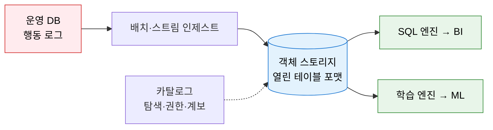
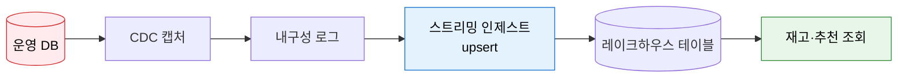
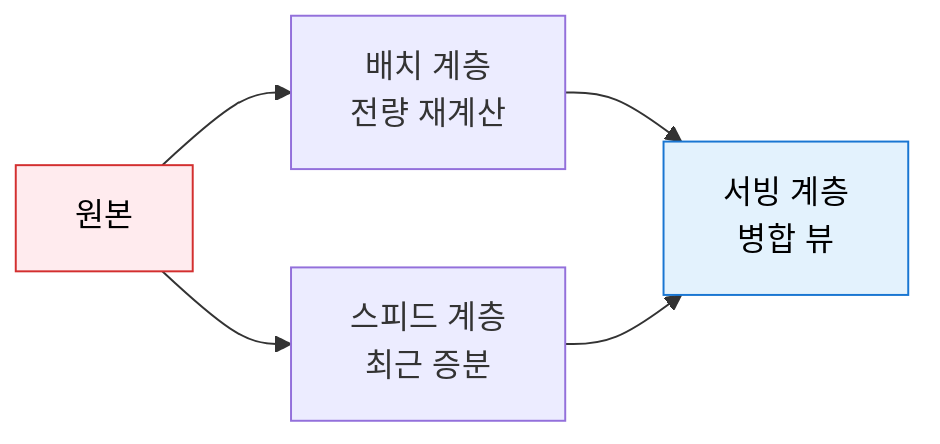
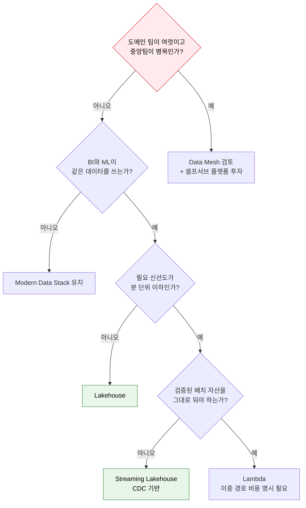

# 이커머스 데이터 플랫폼 현대화 아키텍처 선택

> **전제 (샘플 문서를 위해 가정한 값)**
> 이 네 가지가 스타일 선택을 결정하므로, 실제 작성 시에는 반드시 확인한 값을 쓴다.
>
> | 항목 | 가정값 |
> | --- | --- |
> | 지연 요구 | 재고·추천은 **분 단위**, 매출 리포트는 일 배치 |
> | 조직 형태 | **중앙 데이터팀 1개(4명)**, 도메인별 데이터 인력 없음 |
> | 기존 자산 | Redshift + 야간 배치 ETL 3년째 운영, 대시보드 약 120개 |
> | 주 소비처 | BI(운영·재무) + **신설 ML팀**(추천·수요예측) 혼합 |

---

## 1. 저장은 한 번, 조회는 엔진 자유롭게, 데이터 플랫폼 현대화의 개요

**정의**: 객체 스토리지 위의 열린 테이블 포맷으로 단일 저장 복사본을 만들고, 조회
엔진을 분리해 BI와 ML이 같은 데이터를 쓰게 하는 레이크하우스(Lakehouse) 아키텍처.

- **적용 범위**: 주문·재고·상품·행동 로그 등 분석 대상 전체. 운영 DB(OLTP)는 대상이 아니다.
- **핵심 산출물**: 열린 포맷 테이블, 테이블 카탈로그, CDC 인제스트 파이프라인, 계층 규약.
- **적용 조건**: 스토리지와 컴퓨트를 따로 증설할 수 있고, 컴팩션·파일 정리를 운영할 인력이 있을 것.

---

## 2. 데이터 플랫폼 아키텍처 스타일 비교

### 가. 스타일별 구조와 동작

#### Modern Data Stack (ELT) — 현재 구성에 가장 가까운 형태

원본을 먼저 적재하고 변환은 웨어하우스 안에서 SQL로 수행한다. SQL 역량만으로 굴러가
소규모 팀이 가장 빨리 가치를 낸다. 다만 ML 피처처럼 비정형·대용량 처리가 들어오면
DW 컴퓨트 비용이 쿼리량에 직결돼 급증한다.

#### Lakehouse — 단일 복사본을 BI와 ML이 공유

저장은 한 벌, 조회 엔진은 교체 가능하다. 포맷이 열려 있어 엔진을 바꿔도 데이터 이관이
필요 없고, ACID·스키마 진화·타임 트래블을 얻는다. 소규모 테이블을 잦게 갱신하면
작은 파일이 늘어 컴팩션 운영이 따라온다.

#### Streaming Lakehouse (CDC 기반) — 같은 저장소에 신선도만 추가

변경분만 로그로 흘려 레이크하우스 테이블에 준실시간 반영한다. **실시간용 저장소를
따로 두지 않는다**는 점이 핵심이다. upsert가 잦으면 작은 파일이 폭증하므로 컴팩션과
MoR/CoW 선택이 조회 성능을 좌우한다.

#### Lambda — 배치와 스트림을 나란히 두는 구성

같은 로직을 배치와 스트림 두 곳에 구현하고 조회 시 병합한다. 검증된 배치 자산이 크고
그 위에 실시간 뷰만 얹어야 할 때 성립한다. 두 경로가 시간이 지나며 어긋나는 것이
이 스타일의 고유 비용이다.

### 나. 스타일 비교표

| 축 | Modern Data Stack | Lakehouse | Streaming Lakehouse | Lambda |
| --- | --- | --- | --- | --- |
| 지연 | 시간~일 배치 | 시간~일 배치 | 분 | 배치는 일, 스트림은 초 |
| 파이프라인 수 | 단일 경로 | 단일 경로 | 단일 경로 | **배치+스트림 이중** |
| 저장 복사본 | DW 단일 | 단일 | 단일 | 배치·스피드 이중 |
| 거버넌스 주체 | 중앙 | 중앙 | 중앙 | 중앙 |
| 재처리 방법 | 백필 잡 | 백필 잡 | 로그 리플레이 | 배치 재계산 |
| 주 비용 동인 | DW 컴퓨트 | 스토리지 + 컴팩션 운영 | 스토리지 + 스트림 운영 | 이중 코드 유지 |

> **표에 올리지 않은 것**
> - **Medallion(Bronze/Silver/Gold)** — 레이크하우스 *내부*의 계층 규약이다. 대안이
>   아니라 채택 후 적용할 규칙이므로 3단락에서 다룬다.
> - **Data Mesh** — 조직 설계다. 전제의 조직 형태(중앙팀 1개)에서 성립하지 않으므로
>   후보에서 제외한다. 소유할 도메인 팀이 없다.
> - **Data Fabric** — 기술 설계이며 메시의 대안이 아니다. 원본 이동이 규제로 막힐 때
>   검토하나, 이 사례는 자사 데이터라 해당 없다.
> - **Semantic Layer** — 어떤 스타일과도 직교한다. 3단락에서 별도로 다룬다.

---

## 3. 선택 기준 및 적용 방안

**결론**: 조직이 중앙팀 1개이므로 Data Mesh는 탈락. BI와 ML이 같은 데이터를 쓰고
재고·추천이 분 단위를 요구하므로 **Lakehouse 기반 + CDC 스트리밍 인제스트**를 택한다.
Redshift 배치 자산은 대시보드 120개가 걸려 있어 즉시 폐기하지 않고, 마지막 단계에서
소비처를 옮긴 뒤 정리한다. Lambda는 이중 코드 경로를 감수할 이유가 없어 제외한다.

**함께 정할 것 (별개의 결정이다)**
- **테이블 포맷** = 파일 레이아웃·트랜잭션 규약 → Iceberg / Delta Lake / Hudi 중 택1
- **카탈로그** = 테이블 탐색·권한·계보 → Unity Catalog / Polaris / Nessie / Glue 중 택1

포맷을 골랐다고 카탈로그가 정해지지 않는다. 카탈로그를 정하지 않으면 엔진마다 테이블이
보이지 않는 사고가 난다.

**계층 규약**: 레이크하우스 내부는 Medallion을 적용한다 — Bronze(원본 그대로),
Silver(정제·표준화), Gold(업무 집계). 단순 파이프라인까지 3홉으로 강제하지 않는다.

**의미 계층**: 매출 지표 정의를 한 곳에 두어 BI 도구마다 수치가 달라지는 문제를 막는다.
스타일 선택과 무관하게 얹을 수 있으므로 3단계 이후 별도로 추진한다.

### 단계별 도입안

| 단계 | 목표 | 산출물 | 완료 판정 |
| --- | --- | --- | --- |
| 1. 기반 구축 | 저장·카탈로그 확정 | 테이블 포맷·카탈로그 선정서, Bronze 적재 파이프라인 | 주문·재고·상품 3개 테이블이 카탈로그에서 조회되고, 타임 트래블로 7일 전 스냅샷 복원 성공 |
| 2. 배치 이관 | 기존 리포트를 레이크하우스로 | Silver·Gold 테이블, dbt 변환 이관 | 대시보드 120개 중 상위 20개가 신규 테이블만 참조, 기존 대비 수치 차이 0건 |
| 3. 신선도 확보 | 재고·추천 준실시간화 | CDC 캡처, 스트리밍 인제스트, 컴팩션 잡 | 운영 DB 커밋 후 재고 테이블 반영까지 P95 5분 이하, 일일 작은 파일 수 증가율 0 |
| 4. 정리 | 이중 저장 해소 | Redshift 소비처 이전 계획, 폐기 절차 | 남은 대시보드 전량 이관, Redshift 야간 배치 잡 0개, 저장 복사본 1벌 |

완료 판정은 모두 관측 가능한 값으로 적었다. "성능 개선", "안정화" 같은 표현은
판정 기준이 될 수 없다.
