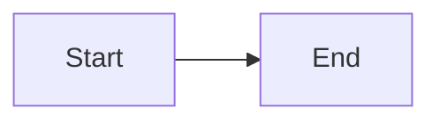

# Hextra Theme: hugo.toml Template

Replace `<USERNAME>`, `<REPO_NAME>`, `<SITE_TITLE>`, `<DESCRIPTION>` before use.

**Key ordering rule:** All root-level keys MUST come before any `[table]` sections.

```toml
baseURL = "https://<USERNAME>.github.io/<REPO_NAME>/"
title = "<SITE_TITLE>"
theme = "hextra"
defaultContentLanguage = "ko"   # Korean i18n: search placeholder "검색...", TOC "목차" etc.
enableRobotsTXT = true
enableGitInfo = false
hasCJKLanguage = true   # set true for Korean/Chinese/Japanese content

[markup]
  [markup.goldmark]
    [markup.goldmark.renderer]
      unsafe = true   # required for Hextra shortcodes with raw HTML

[outputs]
  home = ["html"]
  page = ["html"]
  section = ["html", "rss"]

[params]
  description = "<DESCRIPTION>"
  displayUpdatedDate = true
  dateFormat = "2006년 1월 2일"

  [params.navbar]
    displayTitle = true
    displayLogo = false
    width = "full"

  [params.page]
    width = "normal"   # full | wide | normal

  [params.theme]
    default = "system"   # light | dark | system
    displayToggle = true

  [params.footer]
    enable = true
    displayCopyright = true
    displayPoweredBy = false
    width = "normal"

  [params.search]
    enable = true
    type = "flexsearch"
    [params.search.flexsearch]
      index = "content"
      tokenize = "forward"

  [params.toc]
    displayTags = true

  [params.highlight.copy]
    enable = true
    display = "hover"

[[menu.main]]
  name = "검색"
  weight = 0
  [menu.main.params]
    type = "search"   # REQUIRED: renders the search box in the navbar

[[menu.main]]
  name = "Docs"
  pageRef = "/docs"
  weight = 1

[[menu.main]]
  name = "GitHub"
  url = "https://github.com/<USERNAME>/<REPO_NAME>"
  weight = 99
  [menu.main.params]
    icon = "github"
```

## Installation (zip method)

```bash
curl -L https://github.com/imfing/hextra/archive/refs/heads/main.zip -o /tmp/hextra.zip
cd /tmp && unzip -q hextra.zip
mv hextra-main <PROJECT_ROOT>/themes/hextra
rm <PROJECT_ROOT>/themes/hextra/go.mod   # CRITICAL: prevents Hugo module conflict
```

## Content Structure

```
content/
├── _index.md          # Home page (layout: hextra-home)
└── docs/
    ├── _index.md      # Docs section index
    ├── section-1/
    │   ├── _index.md  # Section index (shows in sidebar)
    │   └── page.md    # Content page
    └── section-2/
        └── ...
```

## Home Page Template

```markdown
---
title: Site Title
layout: hextra-home
---

Your Headline
Your subtitle text



  
  

```

## Valid Icon Names

Check `themes/hextra/data/icons.yaml` for the full list. Commonly needed icons:

| Use case | Icon name |
|----------|-----------|
| Fast/quick | `lightning-bolt` (NOT `bolt`) |
| Tools/debug | `terminal` (NOT `wrench-screwdriver`) |
| Learning | `academic-cap` |
| Team | `user-group` |
| Settings | `cog` |
| Security | `shield-check` |
| Server | `server` |
| Database | `database` |
| Lab/test | `beaker` |
| Analytics | `chart-bar` |
| Global | `globe` |
| GitHub | `github` |

## Shortcodes Reference

### Hugo shortcode delimiter rule (critical)

`` — raw content: inner text is NOT processed as Markdown. Use for shortcodes whose content is pure text or HTML.

`{}` — Markdown content: inner text IS processed as Markdown. **Required** for shortcodes that contain headings (`###`), code fences (` ``` `), or other Markdown syntax.

```markdown
Info message
Warning message
Error message

Content

{}
### Step 1
Markdown content, code blocks, callouts all work here.
```bash
some command
```
### Step 2
Content
{}
```

**Common mistake**: `` renders `###` headings and code fences as raw text. Always use `{}` for steps that contain Markdown.

## Sidebar Navigation

Sidebar is auto-generated from `content/docs/` directory structure. Control ordering with `weight` in front matter:

```yaml
---
title: "Section Title"
weight: 1
next: /docs/section/first-page
---
```

## Mermaid Diagrams

Hextra supports Mermaid natively. Use fenced code blocks:

````markdown

````
