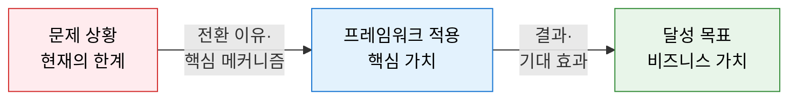
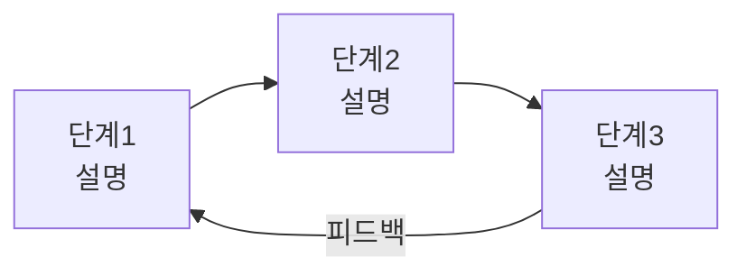
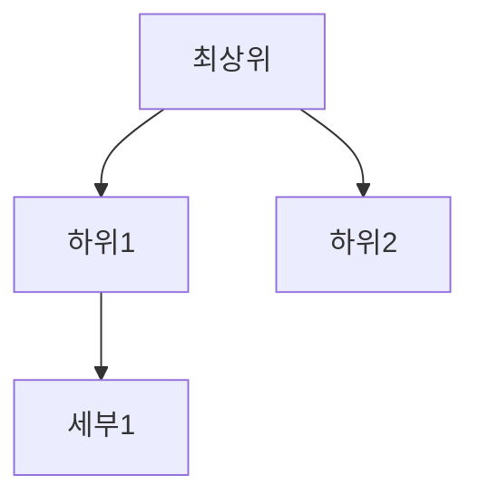
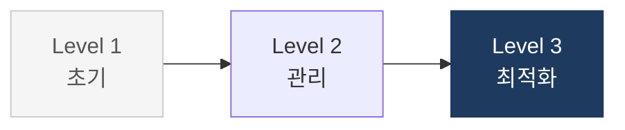

# 기술사 1교시형 콘텐츠 작성

이 스킬은 IT 전문가 수험 및 실무 문서에서 사용하는 구조화된 프레임워크 설명 문서를 작성한다.

## 문서 구조 (3단락 고정)

```
## 1. [한마디 설명], [프레임워크명]의 개요   ← 블록 다이어그램 + 개념 + 특징
## 2. [프레임워크명]의 핵심 구성 체계
### 가. [첫 번째 소주제]                     ← 다이어그램 + 표
### 나. [두 번째 소주제]                     ← 다이어그램 + 표
## 3. [프레임워크명] 도입의 기대효과 및 활용 방안   ← 4행 표
```

---

## 1단락: 개요 작성 규칙

### 제목 형식
```
## 1. [핵심 한마디], [프레임워크명]의 개요
```
**예시:**
- `1. 맞춤형 IT 거버넌스 설계를 위한 프레임워크, COBIT 2019의 개요`
- `1. 비즈니스 규칙을 외부 기술 변화로부터 보호하는 의존성 관리 아키텍처, Clean Architecture의 개요`
- `1. 지연된 소프트웨어 프로젝트에 인력을 추가하면 더 늦어진다, Brooks' Law의 개요`

한마디는 해당 프레임워크의 본질을 압축하는 문구여야 한다. "~를 위한 프레임워크" 형식보다 현상·역설·가치를 직접 표현하는 것이 좋다.

**제목 길이**: 제목 전체가 한 줄에 들어와야 한다. `[핵심 한마디]` 부분은 **20자 이내**를 목표로 핵심 동사 하나로 관통하도록 압축한다.
- ❌ `잠재적 고장을 사전에 식별하고 위험도 기반으로 선제 대응하는 신뢰성 분석 기법` (너무 김)
- ✅ `잠재 고장을 RPN으로 선제 차단하는 신뢰성 분석 기법` (핵심 동사로 압축)

### 블록 다이어그램 (필수)
제목 바로 아래, 개념 설명 전에 **3노드 LR 흐름도**를 배치한다.



- A(빨강): 현재 문제·한계 상황
- B(파랑): 프레임워크의 핵심 작동 방식
- C(녹색): 달성하는 비즈니스 가치

### 정의·특징 형식
```markdown
**정의**: [핵심 메커니즘]으로 [목적]을 달성하는 [유형] 프레임워크/방법론/원칙.
- [부가 설명 1 — 적용 범위·대상]
- [부가 설명 2 — 핵심 산출물·지표]
- [부가 설명 3 — 적용 시점·조건]

**특징**:
- **[키워드]**: [설명] — 핵심 차별점
- **[키워드]**: [설명]
- **[키워드]**: [설명]
```

- **정의 한 줄 원칙**: 정의 문장 자체는 반드시 한 줄로 완결한다. 부가 설명(범위·산출물·적용 시점 등)은 아래 불릿으로 개조식 추가.
- 특징은 3개, 각각 볼드 키워드로 시작한다.

---

## 2단락: 가·나 소주제 작성 규칙

### 소주제 제목 패턴

| 유형 | 가. 예시 | 나. 예시 |
|---|---|---|
| 구성·원칙 | 4대 핵심 원칙 | 구현 절차 및 적용 방안 |
| 분류·체계 | 5단계 성숙도 구조 | 진단 및 개선 로드맵 |
| 비교·진화 | A vs B 비교 | 아키텍처·구현 패턴 |
| 개념·도구 | 핵심 구성 요소 | 프로세스 및 활용 사례 |

### 다이어그램 유형 선택 기준

**2×2 그리드** — 4~8개 병렬 개념 분류 시
```mermaid
flowchart TD
    subgraph R1["　"]
        direction LR
        A["개념1<br/>설명"] B["개념2<br/>설명"]
    end
    subgraph R2["　"]
        direction LR
        C["개념3<br/>설명"] D["개념4<br/>설명"]
    end
    style R1 fill:none,stroke:none
    style R2 fill:none,stroke:none
```

**단계별 흐름 (LR)** — 순서·절차·사이클


**계층 구조 (TD)** — 상위→하위, 포함 관계


**성숙도 단계 (LR)** — 레벨 1→5 진화


### 색상 팔레트 (일관 적용)

| 용도 | fill | stroke | color |
|---|---|---|---|
| 파랑 (기본·1순위) | `#E3F2FD` | `#1976D2` | `#000` |
| 보라 (2순위) | `#F3E5F5` | `#7B1FA2` | `#000` |
| 주황 (3순위) | `#FFF3E0` | `#F57C00` | `#000` |
| 빨강 (4순위·문제) | `#FFEBEE` | `#D32F2F` | `#000` |
| 녹색 (결과·완료) | `#E8F5E9` | `#388E3C` | `#000` |
| 네이비 (핵심·중심) | `#1E3A5F` | `#1E3A5F` | `#fff` |
| 청록 | `#E0F2F1` | `#00796B` | `#000` |

---

## 3단락: 기대효과 표 형식

항상 **4행 3열 표**로 작성한다.

```markdown
## 3. [프레임워크명] 적용의 기대효과 및 활용 방안

| 구분 | 주요 기대효과 | 활용 및 실무 적용 방안 |
|---|---|---|
| **[영역1]** | [효과 설명] | [구체적 활용 방안] |
| **[영역2]** | [효과 설명] | [구체적 활용 방안] |
| **[영역3]** | [효과 설명] | [구체적 활용 방안] |
| **[영역4]** | [효과 설명] | [구체적 활용 방안] |
```

구분 영역은 전략적·운영적·기술적·문화적, 또는 해당 프레임워크의 핵심 관점으로 나눈다.

---

## Mermaid 작성 금지 사항 (CONTENT_GUIDE)

아래 규칙을 위반하면 렌더링 오류가 발생한다.

| 금지 | 이유 | 대안 |
|---|---|---|
| `\n` 줄바꿈 | Mermaid 파싱 오류 | `<br/>` 사용 |
| 괄호 내 `<br/>` | `"(텍스트<br/>텍스트)"` 파싱 오류 | 괄호 밖으로 이동하거나 제거 |
| subgraph 레이블에 이모지 | 파싱 오류 | 이모지 제거 |
| `A --> B & C` 다중 연결 | 일부 버전 오류 | `A --> B` + `A --> C` 분리 |
| `<1ms` 등 꺾쇠+숫자 | MDX가 JSX 태그로 오인 | `1ms 미만` 등 한국어 표현 |
| `Node0[\`\`\`]` | 코드블록 종료로 오인 | 해당 노드 제거 |

---

## 완성 예시 구조

```markdown
---
sidebar_position: N
title: [프레임워크명]
---

# [프레임워크명]
**[영문 풀네임]**

## 1. [한마디 설명], [프레임워크명]의 개요

\`\`\`mermaid
flowchart LR
    A["문제 상황"] --"전환 이유"--> B["핵심 적용"] --"기대 효과"--> C["달성 목표"]
    style A fill:#FFEBEE,stroke:#D32F2F,color:#000
    style B fill:#E3F2FD,stroke:#1976D2,color:#000
    style C fill:#E8F5E9,stroke:#388E3C,color:#000
\`\`\`

**정의**: [핵심 메커니즘]으로 [목적]을 달성하는 기법/방법론/프레임워크.
- [부가 설명 1]
- [부가 설명 2]
- [부가 설명 3]

**특징**:
- **키워드1**: 설명
- **키워드2**: 설명
- **키워드3**: 설명

---

## 2. [프레임워크명]의 핵심 구성 체계

### 가. [소주제 — 구성·원칙·분류]

\`\`\`mermaid
[다이어그램]
\`\`\`

| 항목 | 설명 | 비고 |
|---|---|---|

---

### 나. [소주제 — 절차·비교·적용]

\`\`\`mermaid
[다이어그램]
\`\`\`

| 항목 | 설명 | 적용 방안 |
|---|---|---|

---

## 3. [프레임워크명] 도입의 기대효과 및 활용 방안

| 구분 | 주요 기대효과 | 활용 및 실무 적용 방안 |
|---|---|---|
| **영역1** | 효과 | 활용 방안 |
| **영역2** | 효과 | 활용 방안 |
| **영역3** | 효과 | 활용 방안 |
| **영역4** | 효과 | 활용 방안 |
```

---

## 가·나 소주제 결정 가이드

사용자가 소주제를 명시한 경우 그대로 사용한다.
명시하지 않은 경우 프레임워크 유형에 따라 다음 패턴을 선택한다.

- **거버넌스·표준**: 가. 핵심 원칙/구성 요소 / 나. 성숙도·준수 절차
- **아키텍처 패턴**: 가. 구조·계층·역할 분리 / 나. 의존성·변형 패턴·비교
- **분석 방법론**: 가. 단계별 절차 / 나. 도구·적용 메커니즘
- **보안 프레임워크**: 가. 위협·통제 분류 체계 / 나. 탐지·대응 절차
- **조직·경영**: 가. 핵심 원칙·모델 구조 / 나. 실무 적용·리더십 전략
