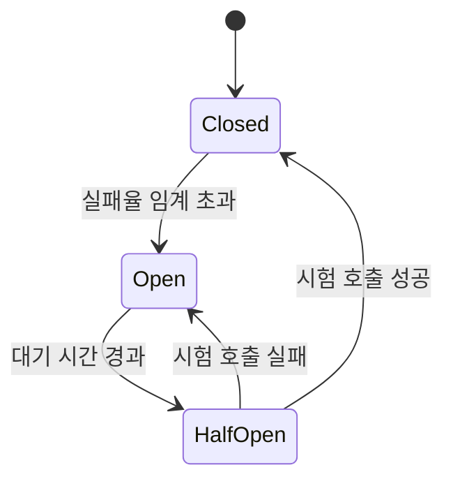

## 1. 장애 전파를 끊는 자동 차단기, Circuit Breaker의 개요

**정의**: 원격 호출의 실패율을 감시해 임계를 넘으면 호출을 즉시 차단(fail-fast)하고
일정 시간 뒤 자동 복구를 시도하는 장애 격리 패턴.

- 적용 범위: 마이크로서비스 간 동기 호출, 외부 API·결제 게이트웨이 등 통제 불가한 의존성
- 핵심 산출물: 상태 전이 정책(임계값·대기 시간·표본 수), 폴백 응답, 상태 전이 지표
- 적용 시점: 호출 대상이 느려지거나 실패할 때 **호출자의 자원까지 고갈되는** 구조일 때

---

## 2. Circuit Breaker의 핵심 구성 체계

### 가. 상태 전이 구조

| 상태 | 호출 처리 | 전이 조건 |
| --- | --- | --- |
| Closed | 정상 통과, 실패율 집계 | 실패율이 임계 초과 → Open |
| Open | 즉시 실패 반환, 원격 호출 없음 | 대기 시간 경과 → Half-Open |
| Half-Open | 제한된 수의 시험 호출만 통과 | 성공 → Closed / 실패 → Open |

Open 상태의 값어치는 "호출을 못 하게 막는 것"이 아니라 **호출자의 스레드·커넥션을
붙잡지 않는 것**이다. 타임아웃만 걸면 자원은 타임아웃 시간만큼 계속 묶인다.

### 나. 임계값 설계 요소

| 요소 | 의미 | 잘못 잡으면 |
| --- | --- | --- |
| 실패율 임계 | Open으로 넘어가는 실패 비율 | 낮으면 정상 트래픽에도 차단, 높으면 차단이 늦음 |
| 최소 표본 수 | 판정에 필요한 최소 호출 건수 | 없으면 호출 2건 실패로 전체가 차단됨 |
| 관측 윈도 | 실패율을 세는 구간(건수 또는 시간) | 너무 길면 과거 실패가 현재를 계속 차단 |
| Open 대기 시간 | 복구 시도까지의 간격 | 짧으면 죽은 대상을 계속 두드림 |
| Half-Open 허용 수 | 시험 호출 동시 허용 건수 | 크면 복구 중인 대상을 다시 무너뜨림 |
| 폴백 | 차단 시 반환할 응답 | 없으면 차단이 그대로 사용자 오류가 됨 |

**최소 표본 수**가 실무에서 가장 자주 빠진다. 이 값이 없으면 트래픽이 적은 새벽에
실패 몇 건만으로 서킷이 열려, 장애가 없는데 장애가 만들어진다.

---

## 3. Circuit Breaker 도입의 기대효과 및 활용 방안

| 구분 | 기대효과 | 활용 방안 |
| --- | --- | --- |
| 가용성 | 하나의 느린 의존성이 전체 서비스로 번지지 않음 | 결제·배송조회 등 외부 연동 구간에 우선 적용 |
| 자원 보호 | 스레드·커넥션 풀 고갈 차단 | 벌크헤드(자원 격리)와 함께 적용해 풀 자체를 분리 |
| 복구 속도 | 사람 개입 없이 자동 재시도·복귀 | Half-Open 허용 수를 1~2로 두어 재붕괴 방지 |
| 운영 가시성 | 상태 전이가 지표로 남아 장애 시점이 명확해짐 | 상태 전이를 이벤트로 수집해 알림·대시보드에 연결 |

**적용 시 주의**: 재시도(Retry)와 함께 쓰면 재시도가 실패를 증폭해 서킷을 더 빨리
열 수 있다. 재시도는 서킷 브레이커 **안쪽**에 두고, 지수 백오프와 지터를 함께 건다.
